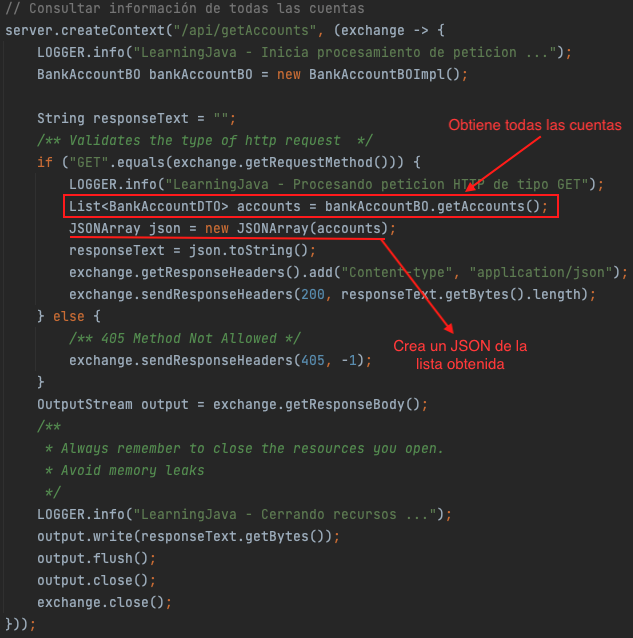

# :tv: Video y Presentacion
- [TBD]
- [TBD]
- [TBD]

# Estructuras de Datos

# :hammer_and_wrench:  Requisitos
- Java 11
- IDE
    * [Visual Studio Code](https://code.visualstudio.com/download)
    * [IntelliJ](https://www.jetbrains.com/idea/download)
- [Postman](https://www.postman.com/downloads/)
- [json-20220320.jar](https://repo1.maven.org/maven2/org/json/json/20220320/)

# :pencil: Actividad
## Consultar información de todas las cuentas bancarias existentes.
> Esta actividad continua a la descrita en la clase anterior: [README](https://github.com/wizelineacademy/BAZJAVA12022/blob/main/3/ExpReg/README.md)
1. Generar una Clase de tipo **enum** que contiene los códigos de algunos países.
    ```java
    public enum Country {
        US, MX, FR
    }
    ```

2. Modificar la clase __Utils__ creando métodos que generan información aleatoria util para construir la información de las cuentas.
    ```java
   public class Utils {
   /*
      code
   */
   
    public static long randomAcountNumber() {
        return new Random().nextLong();
    }

    public static double randomBalance() {
        return new Random()
                .doubles(1000, 9000)
                .limit(1)
                .findFirst()
                .getAsDouble();
    }

    public static AccountType pickRandomAccountType() {
        // Creando un arreglo a partir de valores ya definidos
        AccountType[] accountTypes = AccountType.values();
        return accountTypes[new Random().nextInt(accountTypes.length)];
    }

    public static String randomInt() {
        return String.valueOf(new Random().ints(1, 10)
                .findFirst()
                .getAsInt());
    }
    
    /**
    * Gets country.
    *
    * @param country código de pais
    * @return nombre del pais correspondiente al código recibido
    */
    public static String getCountry(Country country) {
          Map<Country, String> countries = new HashMap<>();
          countries.put(Country.US, "United States");
          countries.put(Country.MX, "Mexico");
          countries.put(Country.FR, "France");
          return countries.get(country);
      }
   }
    ```
   > Estos métodos serán útiles para generar información diferente para cada una de las cuentas que se almacenaran en la lista final.

3. Definimos un nuevo método, que regresara una lista de tipo _BankAccountDTO_ que contiene todas las cuentas existentes, en la interface __BankAccountBO__.
    ```java
    public interface BankAccountBO {
        List<BankAccountDTO> getAccounts(); // <- Regresa una lista de tipo BankAccountDTO
        BankAccountDTO getAccountDetails(String user, String lastUsage);
    }
    ```

4. Implementamos el método creado para obtener la lista de las cuentas y se modifica el método privado encargado de construir los objetos.
    ```java
    public class BankAccountBOImpl implements BankAccountBO{
        @Override
        public List<BankAccountDTO> getAccounts() {
            // Definicion de lista con la informacion de las cuentas existentes.
            List<BankAccountDTO> accountDTOList = new ArrayList<>();
            accountDTOList.add(buildBankAccount("user3@wizeline.com", true, Country.MX, "08-09-2021"));
            accountDTOList.add(buildBankAccount("user1@wizeline.com", false, Country.FR, "07-09-2021"));
            accountDTOList.add(buildBankAccount("user2@wizeline.com" ,false, Country.US, "16-09-2021"));
            return accountDTOList;
        }
        
        @Override
        public BankAccountDTO getAccountDetails(String user, String lastUsage) {
            return buildBankAccount(user, true, Country.MX, lastUsage); // Agregar código de pais
        }

        // Creación de tipo de dato BankAccount con la ayuda de la clase Utils.java
        private BankAccountDTO buildBankAccount(String user, boolean isActive, Country country, String lastUsage) {
            BankAccountDTO bankAccountDTO = new BankAccountDTO();
            bankAccountDTO.setAccountNumber(randomAcountNumber());
            bankAccountDTO.setAccountName("Dummy Account ".concat(randomInt()));
            bankAccountDTO.setUser(user);
            bankAccountDTO.setAccountBalance(randomBalance());
            bankAccountDTO.setAccountType(pickRandomAccountType());
            bankAccountDTO.setCountry(getCountry(country));
            bankAccountDTO.setLastUsage(lastUsage);
            bankAccountDTO.setAccountActive(isActive);
        return bankAccountDTO;
        }
    }
    ```

5. Siguiendo el estilo existente en la clase principal __(LearningJava)__ genera un nuevo _context_ para manejar la solicitud y obtener los datos de todas las cuentas.
   


# :computer: Requests
``` bash
curl --location --request GET 'http://localhost:8080/api/getAccounts'
```
# :bulb: Nota
La petición anterior :point_up_2: se puede importar en Postman siemplemente copiando y pegandola en el apartado __Raw text__ que aparece despues de hacer clic en el boton de __importar__.

# :white_check_mark: 200 Response
```json
[
    {
        "country": "Mexico",
        "accountActive": true,
        "accountName": "Dummy Account 9",
        "accountType": "PLATINUM",
        "lastUsage": "08-09-2021",
        "accountNumber": 672134163492917690,
        "accountBalance": 2944.27040517806,
        "user": "user3@wizeline.com"
    },
    {
        "country": "France",
        "accountActive": false,
        "accountName": "Dummy Account 6",
        "accountType": "NOMINA",
        "lastUsage": "07-09-2021",
        "accountNumber": -2809907130710493942,
        "accountBalance": 7682.979334527755,
        "user": "user1@wizeline.com"
    },
    {
        "country": "United States",
        "accountActive": false,
        "accountName": "Dummy Account 4",
        "accountType": "NOMINA",
        "lastUsage": "16-09-2021",
        "accountNumber": 690593633607299787,
        "accountBalance": 6058.225304384811,
        "user": "user2@wizeline.com"
    }
]
``` 


# :books: Recursos
- [Java in a Nutshell, 5th Edition by David Flanagan](https://www.oreilly.com/library/view/java-in-a/0596007736/ch02s08.html)
- [Interface Map<K,V>](https://docs.oracle.com/javase/8/docs/api/java/util/Map.html)
- [Java Map](https://jenkov.com/tutorials/java-collections/map.html)
- [Interface List<E>](https://docs.oracle.com/javase/8/docs/api/java/util/List.html)
- [Java List](https://jenkov.com/tutorials/java-collections/list.html)
