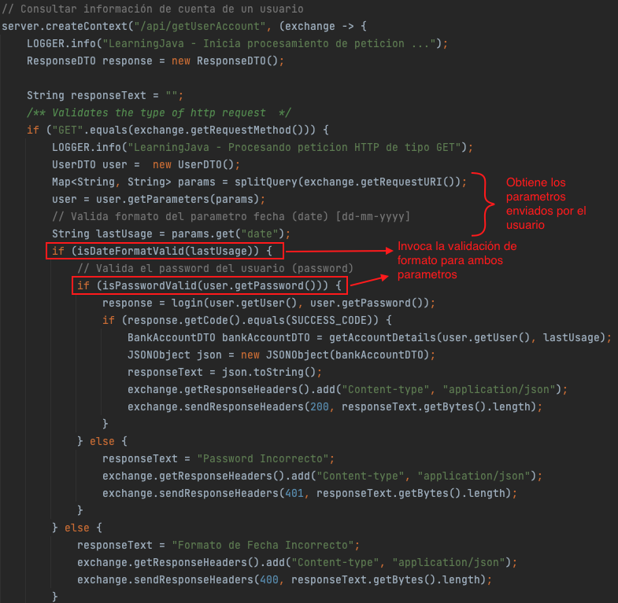

# :tv: Video y Presentacion
- [TBD]
- [TBD]
- [TBD]

# Expresiones Regulares [Java Regex]

# :hammer_and_wrench:  Requisitos
- Java 11
- IDE
    * [Visual Studio Code](https://code.visualstudio.com/download)
    * [IntelliJ](https://www.jetbrains.com/idea/download)
- [Postman](https://www.postman.com/downloads/)
- [json-20220320.jar](https://repo1.maven.org/maven2/org/json/json/20220320/)

# :pencil: Actividad
## Consultar información de una cuenta perteneciente a un usuario específico.
> Esta actividad complementa la descrita en la clase anterior: [README](https://github.com/wizelineacademy/BAZJAVA12022/blob/main/3/TiposDatos/README.md)
1. Complementa con una propiedad de tipo _String_ el DTO que contiene la información de una cuenta de banco __(BankAccountDTO)__. Dicha propiedad sera encargada de almancenar el último uso de esa cuenta.
    ```java
    public class BankAccountDTO {
    
       private long accountNumber;
       private String accountName;
       private String user;
       private double accountBalance;
       private AccountType accountType;
       private String country;
       private boolean accountActive;
       private String lastUsage; // <- último uso de la cuenta 
   }
    ```
   > Recuerda generar los getters y setters correspondientes a cada propiedad.

2. Modifica la interface que recupera la información de la cuenta __(BankAccountBO)__, de manera que ahora reciba como parámetro un dato de tipo _String_ que contiene una fecha.
    ```java
    public interface BankAccountBO {
      BankAccountDTO getAccountDetails(String user, String lastUsage);
    }
    ```
   > El parámetro se envía desde la clase principal __(LearningJava)__

3. De igual manera, será necesario modificar la implementación de la interface.
    ```java
    public class BankAccountBOImpl implements BankAccountBO{

       @Override
       public BankAccountDTO getAccountDetails(String user, String lastUsage) {
          return buildBankAccount(user, true, lastUsage);
        }

        // Creación de tipo de dato BankAccount
        private BankAccountDTO buildBankAccount(String user, boolean isActive, String lastUsage) {
            BankAccountDTO bankAccountDTO = new BankAccountDTO();
            bankAccountDTO.setAccountNumber(123L);
            bankAccountDTO.setAccountName("Dummy Account");
            bankAccountDTO.setUser(user);
            bankAccountDTO.setAccountBalance(843.24);
            bankAccountDTO.setAccountType(AccountType.NOMINA);
            bankAccountDTO.setCountry("Mexico");
            bankAccountDTO.setAccountActive(isActive);
            bankAccountDTO.setLastUsage(lastUsage);
            return bankAccountDTO;
        }
    }
    ```
   > Hacemos uso de dicho parámetro _(lastUsage)_ para actualizar la propiedad _lastUsage_ del DTO _(BankAccountDTO)_ haciendo uso de los métodos de acceso _get_ y _set_.

4. Haremos uso de la clase __Utils__ para generar los metodos de validación de contraseña y formato de fecha [dd-MM-yyyy].
    ```java
    public class Utils {

      // Definicion del patron para validar contraseña
      /**
      * ^           Indica el inicio de la declaracion
      * (?=.*[0-9]) Debe contener un digito del 1 al 9
      * (?=.*[a-z]) Debe contener una letra minuscula
      * (?=.*[A-Z]) Debe contener una letra mayuscula
      * (?=.*[@#$]) Debe contener un caracter especial de los indicados entre corchetes
      * {6,8}       Debe tener una longitud de entre 6 a 8 caracteres
      * $           Indica el final de la declaracion
      */
      private static final String PASSWORD_PATTERN = "^(?=.*[0-9])(?=.*[a-z])(?=.*[A-Z])(?=.*[@#$]).{6,8}$";
      private static final Pattern pattern = Pattern.compile(PASSWORD_PATTERN);

      // Definicion del patron para validar formato de fecha (dd-mm-yyyy)
      private static Pattern DATE_PATTERN = Pattern.compile("^\\d{2}-\\d{2}-\\d{4}$");

       public static boolean isPasswordValid(String password) {
          // Valida la contraseña contra el patron que definimos
          Matcher matcher = pattern.matcher(password);
          return matcher.matches();
       }

       public static boolean isDateFormatValid(String date) {
          // Valida la fecha contra el patron que definimos
          return DATE_PATTERN.matcher(date).matches();
       }
    }
    ```
   > Los métodos de validación de formato se añaden a los ya existentes en la clase _Utils_.

5. En la clase principal __(LearningJava)__ es necesario modificar el bloque de código donde anteriormente agregamos un nuevo contexto, de manera que podamos obtener los nuevos parámetros enviados por el usuario y enviarlos a los métodos que validan su formato.
  
  ```java
    public class LearningJava {
      /*
              code....
       */
      private static BankAccountDTO getAccountDetails(String user, String lastUsage) {
        BankAccountBO bankAccountBO = new BankAccountBOImpl();
        return bankAccountBO.getAccountDetails(user, lastUsage);
      }
    }
  ```
  > Recuerda pasar el parámetro _lastUsage_ al metodo privado encargado de hacer la invocación que regresa la información de la cuenta. 
# :computer: Requests
``` bash
curl --location --request GET 'http://localhost:8080/api/getUserAccount?user=user1@wizeline.com&password=Pass1@&date=12-03-1912'
```
# :bulb: Nota
La petición anterior :point_up_2: se puede importar en Postman simplemente copiando y pegándola en el apartado __Raw text__ que aparece despues de hacer clic en el boton de __importar__.

# :white_check_mark: 200 Response
```json
{
    "country": "Mexico",
    "accountActive": true,
    "accountName": "Dummy Account",
    "accountType": "NOMINA",
    "lastUsage": "12-03-1912",
    "accountNumber": 123,
    "accountBalance": 843.24,
    "user": "user1@wizeline.com"
}
``` 
# :x: 400 Response
```json
{
   Formato de Fecha Incorrecto
}
``` 
# :no_entry: 401 Response
```json
{
   Password Incorrecto
}
``` 


# :books: Recursos
- [Regular Expressions](https://docs.oracle.com/javase/tutorial/essential/regex/index.html)
- [Quick-Start: Regex Cheat Sheet](https://www.rexegg.com/regex-quickstart.html)
- [Java Regular Expressions (Regex) Cheat Sheet](https://www.jrebel.com/blog/java-regular-expressions-cheat-sheet)
