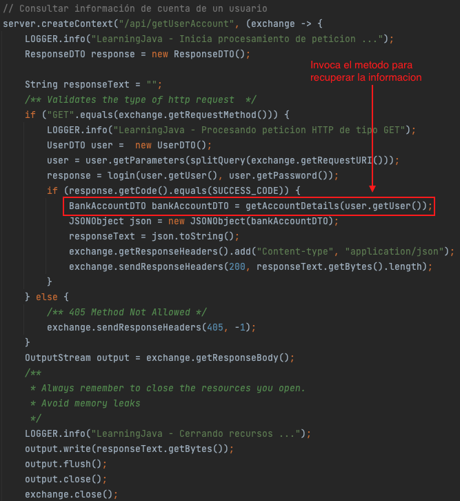

# :tv: Video y Presentacion
- [TBD]
- [TBD]
- [TBD]

# Tipos de Datos

# :hammer_and_wrench:  Requisitos
- Java 11
- IDE
    * [Visual Studio Code](https://code.visualstudio.com/download)
    * [IntelliJ](https://www.jetbrains.com/idea/download)
- [Postman](https://www.postman.com/downloads/)
- [json-20220320.jar](https://repo1.maven.org/maven2/org/json/json/20220320/)

# :pencil: Actividad
## Consultar información de una cuenta perteneciente a un usuario específico.
> Esta actividad complementa la descrita en las clases anteriores: [README](https://github.com/wizelineacademy/BAZJAVA12022/tree/main/3/POO#readme)
1. Generar una Clase de tipo **enum** con la que simularemos los tipos de cuenta.
    ```java
    public enum AccountType {
        NOMINA, AHORRO, PLATINUM
    }
    ```
   > Se recomienda crear un paquete para almacenar este tipo de datos. Ej. __package com.wizeline.enums;__
   
2. Generar un nuevo DTO que contenga la información de una cuenta de banco.
   ```java
    public class BankAccountDTO {
    
       private long accountNumber;
       private String accountName;
       private String user;
       private double accountBalance;
       private AccountType accountType;
       private String country;
       private boolean accountActive;
   
   }
    ```
   > Recuerda generar los getters y setters correspondientes a cada propiedad.

3. Crear una interface dentro del directorio existente: __com.wizeline.BO__ con el metodo a implementar para obtener la información de la cuenta de un usuario.
    ```java
    public interface BankAccountBO {
       BankAccountDTO getAccountDetails(String user);
    }
    ```
   > El usuario de quien se quiere recuperar la información se envía como parámetro.

4. Implementar la interface previamente creada, en cuya implementación se generara la información a consultar.
   ```java
    public class BankAccountBOImpl implements BankAccountBO{

    @Override
    public BankAccountDTO getAccountDetails(String user) {
        return buildBankAccount(user, true);
    }

    // Creación de tipo de dato BankAccount
    private BankAccountDTO buildBankAccount(String user, boolean isActive) {
        BankAccountDTO bankAccountDTO = new BankAccountDTO();
        bankAccountDTO.setAccountNumber(123L);
        bankAccountDTO.setAccountName("Dummy Account");
        bankAccountDTO.setUser(user);
        bankAccountDTO.setAccountBalance(843.24);
        bankAccountDTO.setAccountType(AccountType.NOMINA);
        bankAccountDTO.setCountry("Mexico");
        bankAccountDTO.setAccountActive(isActive);
        return bankAccountDTO;
    }
   }
    ```
   > Crea un método privado que construira la información de la cuenta del usuario haciendo uso del DTO __(BankAccountDTO)__ previamente generado. Recuerda los valores que puede almacenar cada tipo de dato.

5. Siguiendo el estilo existente en la clase principal __(LearningJava)__ genera un nuevo _context_ para manejar la solicitud y obtener los datos de una cuenta.
   
    
    ```java
    public class LearningJava {
      /*
              code....
       */
      private static BankAccountDTO getAccountDetails(String user) {
        BankAccountBO bankAccountBO = new BankAccountBOImpl();
        return bankAccountBO.getAccountDetails(user);
      }
      
    }
    ```
    > Genera un método privado para hacer la invocación de la clase y método encargados de regresar la información de la cuenta. 

# :computer: Requests
``` bash
curl --location --request GET 'http://localhost:8080/api/getUserAccount?user=user1@wizeline.com&password=Pass1'
```
# :bulb: Nota
La petición anterior :point_up_2: se puede importar en Postman siemplemente copiando y pegandola en el apartado __Raw text__ que aparece despues de hacer clic en el boton de __importar__.

# :white_check_mark: Response
```json
{
    "country": "Mexico",
    "accountActive": true,
    "accountName": "Dummy Account",
    "accountType": "NOMINA",
    "accountNumber": 123,
    "accountBalance": 843.24,
    "user": "user1@wizeline.com"
}
``` 

# :books: Recursos
- [The Java® Language Specification](https://docs.oracle.com/javase/specs/jls/se7/html/jls-4.html)
- [Learning Java, 4th Edition by Patrick Niemeyer, Daniel Leuck](https://www.oreilly.com/library/view/learning-java-4th/9781449372477/ch10s02.html)
- [Java For Dummies Quick Reference](https://www.oreilly.com/library/view/java-for-dummies/9781118239742/a83.html)
- [Primitive and Reference Types in Java with Examples](https://www.swtestacademy.com/primitive-and-reference-types-in-java/)
